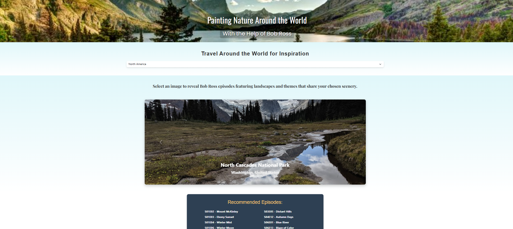

# 🎨 Bob Ross Painting Finder

Welcome to the **Bob Ross Painting Finder**! This application lets you explore paintings, analyze their colors and themes, and discover the joy of Bob Ross's art. Follow the steps below to set up and run the project locally.

---

## 📋 Prerequisites

Make sure you have the following installed on your system:
- **Python 3.8+**
- **PostgreSQL**
- **Pipenv** or your preferred Python package manager
- **Google Cloud Vision API Credentials** (Service Account)

---

## 🚀 Getting Started

### Step 1: Connect to PostgreSQL and Create the Database
1. Open your terminal and connect to PostgreSQL:
   ```bash
   psql -U postgres
2. Create the Database
    ``` bash
    CREATE DATABASE painting_db;
### Step 2: Create the Tables

1. Run the following command to execute the Schema Script:
    ``` bash
    psql -U postgres -d painting_db -f database/schema.sql

2. Enable the pg_trgm extension to support similairty-based searches
    ``` bash
    CREATE EXTENSION IF NOT EXISTS pg_trgm;`

### Step 3: Load the Data!
1. Load the data into the database by running
    ``` bash
    python3 database/load_data.py

### Step 4: Start the Application
1. Start the Flask Application
    ``` bash
    python3 backend/app.py

### Step 5: Explore the Website
1. Open your browser and visit: 
http://127.0.0.1:5005/index.html

# 💡 Additional Notes
Make sure your .env file is configured with the correct Google API Key and other credentials:

`GOOGLE_API_KEY=your_google_api_key`

# Screenshot

